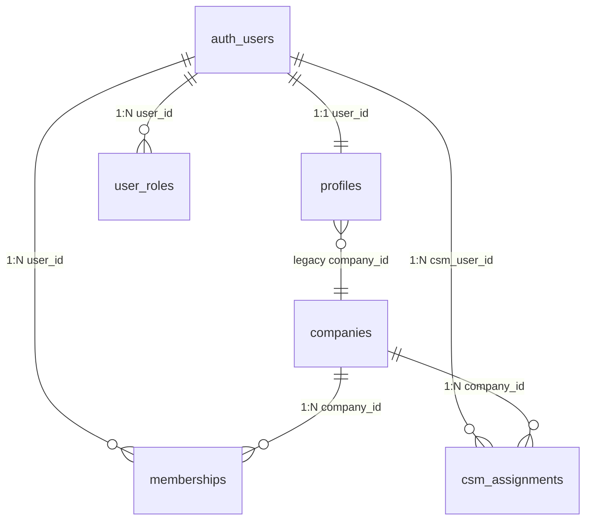
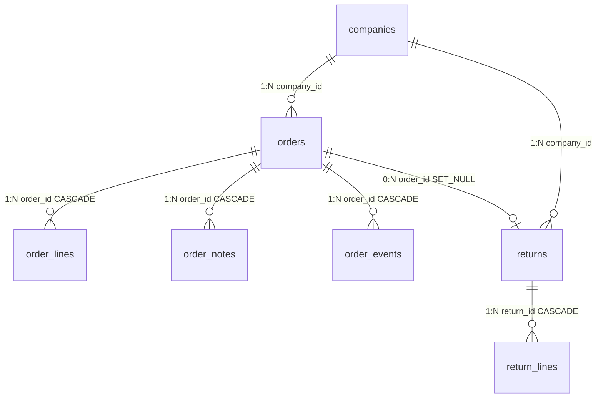
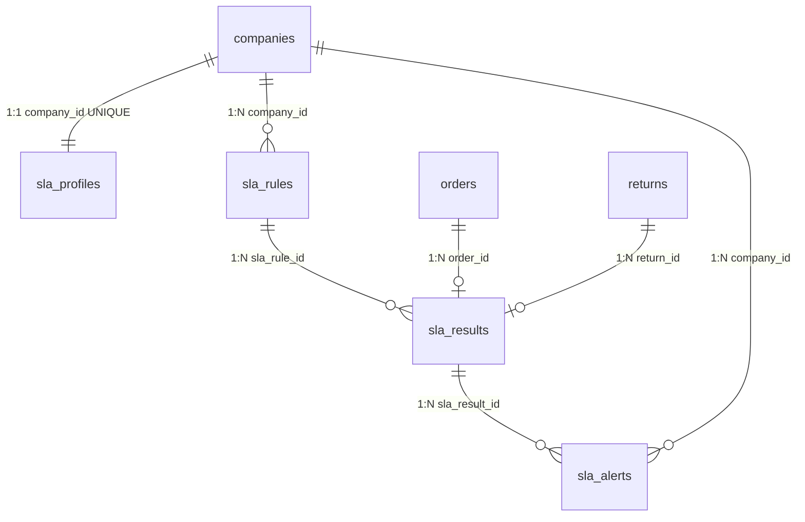
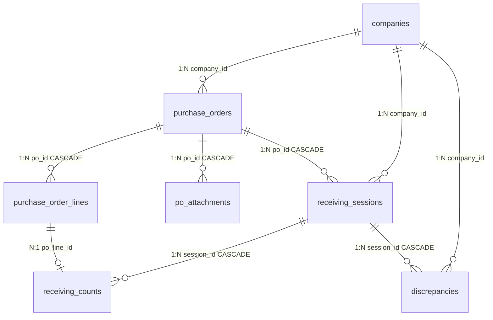

# Entity Relationships

This document describes the relationships between tables in the Ignite database.

---

## Entity Relationship Diagrams

### Authentication & Users

### Order Management

### SLA Management

### Purchase Orders

---

## Relationship Details

### Core Relationships

#### auth.users → profiles (1:1)
- Every authenticated user has exactly one profile
- Created automatically via `handle_new_user()` trigger
- `profiles.user_id` references `auth.users.id`

#### auth.users → user_roles (1:N)
- Users can have multiple roles (though typically one)
- `user_roles.user_id` references `auth.users.id`

#### auth.users → memberships (1:N)
- Users can belong to multiple companies
- `memberships.user_id` references `auth.users.id`
- Each membership has its own role for that company

#### companies → memberships (1:N)
- Companies have multiple member users
- `memberships.company_id` references `companies.id`

---

### Order Relationships

#### companies → orders (1:N)
- Each order belongs to one company
- `orders.company_id` references `companies.id`

#### orders → order_lines (1:N)
- Each order has multiple line items
- `order_lines.order_id` references `orders.id`
- ON DELETE CASCADE

#### orders → order_notes (1:N)
- Each order can have multiple notes
- `order_notes.order_id` references `orders.id`
- ON DELETE CASCADE

#### orders → order_events (1:N)
- Each order has multiple event records
- `order_events.order_id` references `orders.id`
- ON DELETE CASCADE

#### orders → returns (0:N)
- Each order can have multiple returns
- `returns.order_id` references `orders.id`
- ON DELETE SET NULL (return survives order deletion)

#### returns → return_lines (1:N)
- Each return has multiple line items
- `return_lines.return_id` references `returns.id`
- ON DELETE CASCADE

---

### SLA Relationships

#### companies → sla_profiles (1:1)
- Each company has one SLA profile
- `sla_profiles.company_id` is UNIQUE

#### companies → sla_rules (1:N)
- Each company can have multiple SLA rules
- `sla_rules.company_id` references `companies.id`

#### sla_rules → sla_results (1:N)
- Each rule can have results for many orders
- `sla_results.sla_rule_id` references `sla_rules.id`

#### orders/returns → sla_results (1:N)
- Each order can have results for multiple rules
- Unique constraint on (`order_id`, `sla_rule_id`)

#### sla_results → sla_alerts (1:N)
- Each result can generate multiple alerts
- `sla_alerts.sla_result_id` references `sla_results.id`

---

### Purchase Order Relationships

#### companies → purchase_orders (1:N)
- Each PO belongs to one company
- `purchase_orders.company_id` references `companies.id`

#### purchase_orders → purchase_order_lines (1:N)
- Each PO has multiple line items
- `purchase_order_lines.po_id` references `purchase_orders.id`
- ON DELETE CASCADE

#### purchase_orders → receiving_sessions (1:N)
- Each PO can have multiple receiving sessions
- `receiving_sessions.po_id` references `purchase_orders.id`
- ON DELETE CASCADE

#### receiving_sessions → receiving_counts (1:N)
- Each session has multiple count records
- `receiving_counts.session_id` references `receiving_sessions.id`
- ON DELETE CASCADE

#### receiving_sessions → discrepancies (1:N)
- Each session can have multiple discrepancies
- `discrepancies.session_id` references `receiving_sessions.id`
- ON DELETE CASCADE

---

### Integration Relationships

#### companies → api_keys (1:N)
- Each company can have multiple API keys
- `api_keys.company_id` references `companies.id`
- ON DELETE CASCADE

#### companies → webhooks (1:N)
- Each company can have multiple webhooks
- `webhooks.company_id` references `companies.id`
- ON DELETE CASCADE

#### companies → integrations (1:N)
- Each company can have multiple integrations
- Unique constraint on (`company_id`, `type`)
- `integrations.company_id` references `companies.id`
- ON DELETE CASCADE

#### companies → feature_toggles (1:N)
- Each company has feature flag settings
- `feature_toggles.company_id` references `companies.id`
- ON DELETE CASCADE

---

### Analytics Relationships

#### companies → company_kpis (1:N)
- Each company defines their KPIs
- `company_kpis.company_id` references `companies.id`
- ON DELETE CASCADE

#### company_kpis → kpi_measurements (1:N)
- Each KPI has historical measurements
- `kpi_measurements.kpi_id` references `company_kpis.id`
- ON DELETE CASCADE

#### companies → budgets/forecasts (1:N)
- Each company has budget and forecast data
- References `companies.id`
- ON DELETE CASCADE

---

### Quality & Packaging Relationships

#### orders → quality_errors (0:N)
- Errors can be associated with orders
- `quality_errors.order_id` references `orders.id`

#### returns → quality_errors (0:N)
- Errors can be associated with returns
- `quality_errors.return_id` references `returns.id`

#### orders → packaging_records (1:N)
- Each order has packaging data
- `packaging_records.order_id` references `orders.id`
- ON DELETE CASCADE

#### orders → shipping_anomalies (0:N)
- Anomalies linked to orders
- `shipping_anomalies.order_id` references `orders.id`
- ON DELETE CASCADE

---

### ABC Analysis Relationships

#### abc_classifications → abc_recommendations (1:N)
- Each classification can have recommendations
- `abc_recommendations.classification_id` references `abc_classifications.id`
- ON DELETE CASCADE

---

## Cascade Delete Behavior

| Parent Table | Child Tables (CASCADE) |
|--------------|------------------------|
| `orders` | `order_lines`, `order_notes`, `order_events`, `packaging_records`, `shipping_anomalies` |
| `returns` | `return_lines` |
| `purchase_orders` | `purchase_order_lines`, `receiving_sessions`, `po_attachments` |
| `receiving_sessions` | `receiving_counts`, `discrepancies` |
| `companies` | `api_keys`, `webhooks`, `integrations`, `feature_toggles`, `sla_profiles`, `sla_rules`, etc. |
| `sla_rules` | `sla_results` |
| `sla_results` | `sla_alerts` |
| `company_kpis` | `kpi_measurements` |
| `abc_classifications` | `abc_recommendations` |
| `auth.users` | `profiles`, `user_roles`, `memberships`, `csm_assignments` |

---

## Special Relationships

### Soft References (No FK)

Some tables reference others without foreign keys for flexibility:

- `quality_errors.order_id` → FK exists
- `clarification_cases.related_order_id` → FK optional
- `demand_forecasts.sku` → No FK to inventory

### Denormalized Data

For performance, some data is denormalized:

- `orders.company_name` - Cached from `companies.name`
- `order_notes.user_name` - Cached from `profiles.full_name`
- `order_events.company_id` - Duplicated from `orders.company_id`
- `kpi_measurements.company_id` - Duplicated from parent KPI

### Self-References

- `root_cause_categories.parent_category_id` → `root_cause_categories.id` (hierarchical categories)
